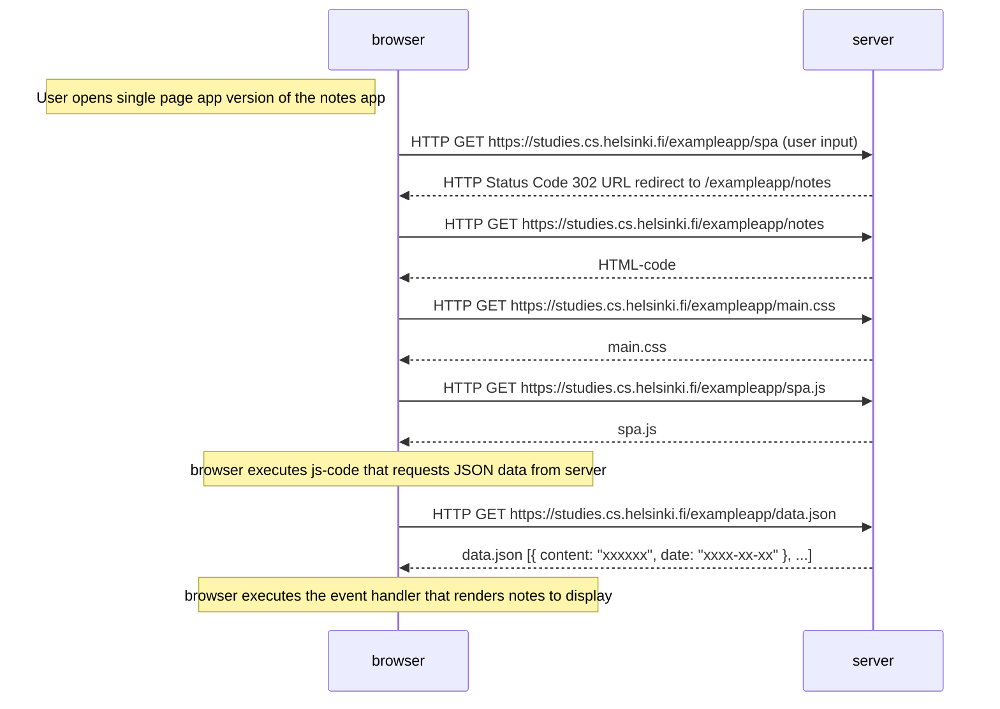

```mermaid
	sequenceDiagram
        Note left of browser: User opens single page app version of the notes app
		browser->>server: HTTP GET https://studies.cs.helsinki.fi/exampleapp/spa (user input)
        server-->>browser: HTTP Status Code 302 URL redirect to /exampleapp/notes
        browser->>server: HTTP GET https://studies.cs.helsinki.fi/exampleapp/notes
        server-->>browser: HTML-code
        browser->>server: HTTP GET https://studies.cs.helsinki.fi/exampleapp/main.css
        server-->>browser: main.css
        browser->>server: HTTP GET https://studies.cs.helsinki.fi/exampleapp/spa.js
        server-->>browser: spa.js

        Note over browser: browser executes js-code that requests JSON data from server

        browser->>server: HTTP GET https://studies.cs.helsinki.fi/exampleapp/data.json
        server-->>browser: data.json [{ content: "xxxxxx", date: "xxxx-xx-xx" }, ...]
        
        Note over browser: browser executes the event handler that renders notes to display
```