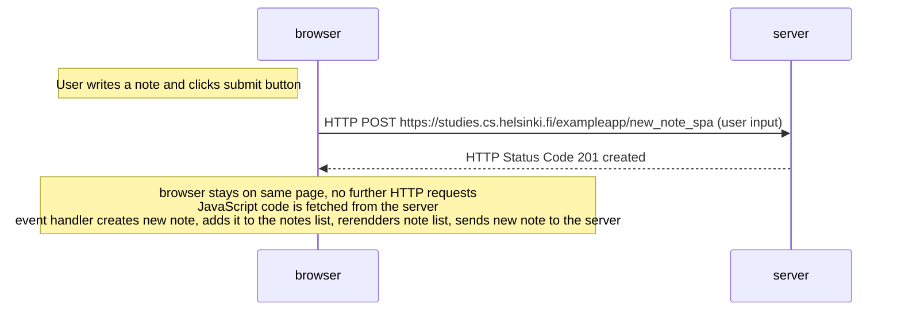

```mermaid
	sequenceDiagram
        Note left of browser: User writes a note and clicks submit button
		browser->>server: HTTP POST https://studies.cs.helsinki.fi/exampleapp/new_note_spa (user input)
        server-->>browser: HTTP Status Code 201 created
        Note over browser: browser stays on same page, no further HTTP requests <br/> JavaScript code is fetched from the server <br/> event handler creates new note, adds it to the notes list, rerendders note list, sends new note to the server
```